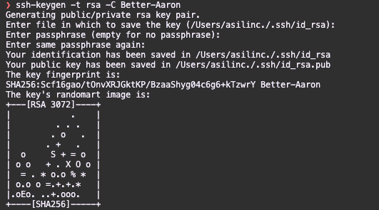
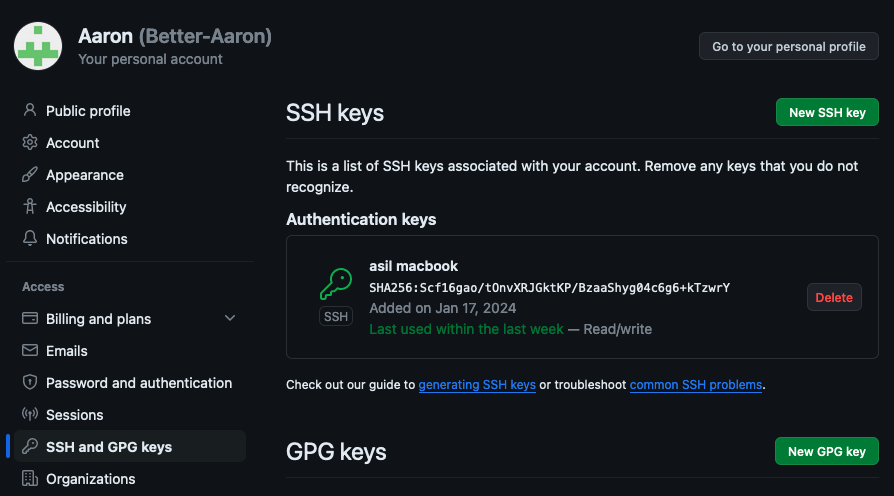

## 새 PC에 SSH키를 생성하고 github에 새로 등록해주어야 함.

1. key 생성

```
ssh-keygen -t rsa -C [GITHUB ID]
ssh-keygen -t rsa -C Better-Aaron
```



2. github 등록
   /Users/asilinc./.ssh/id_rsa.pub 파일오픈  
   ssh-rsa로 시작하고 = [GITHUB ID]로 끝나는 문자열을 복사  
   깃허브에 등록 (Settings -> SSH AND GPG KEY 메뉴에 new SSH key 버튼 클릭후 복사)


